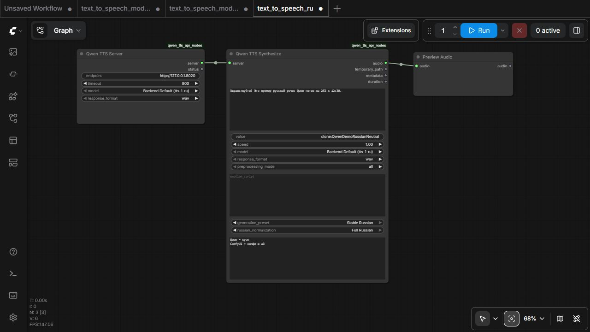
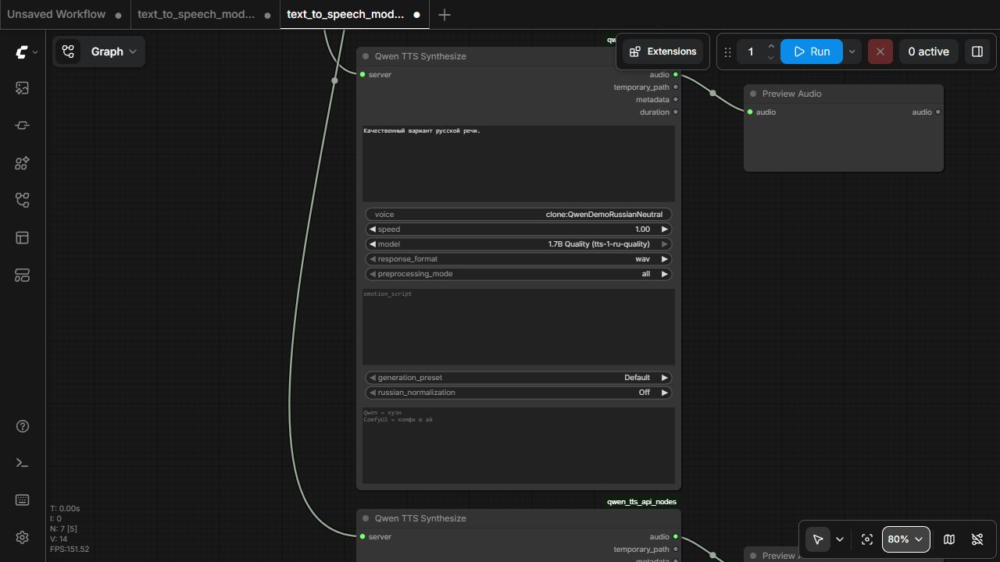
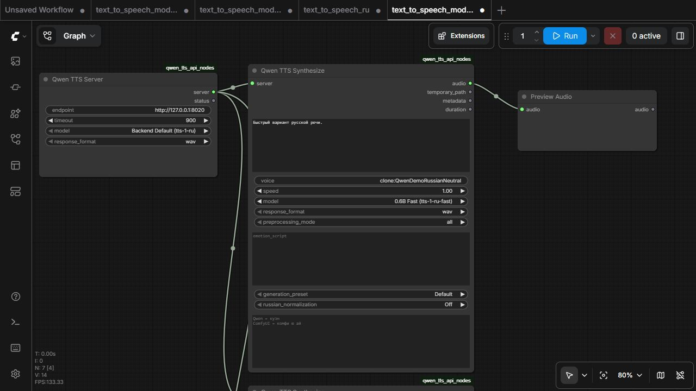
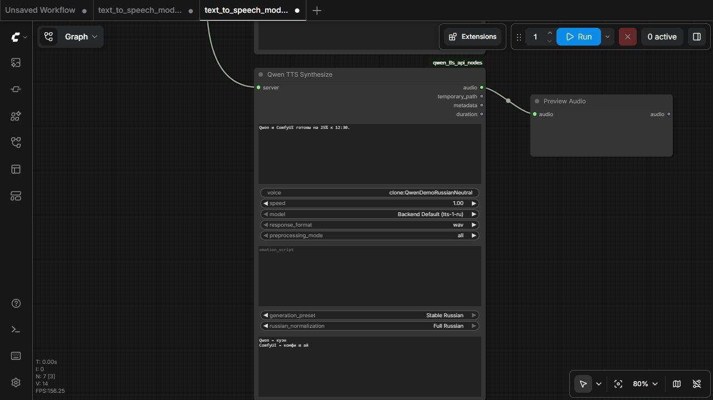
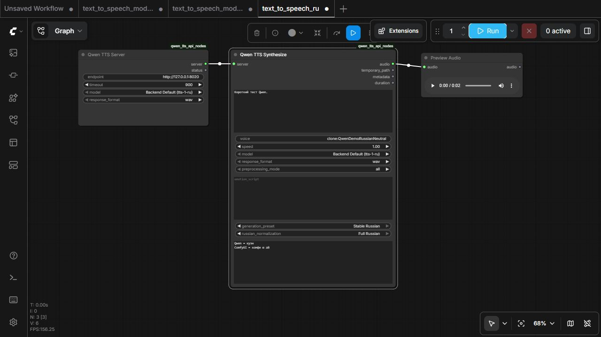

# ComfyUI Quick Start

1. Откройте папку `qwen3-tts-st` в Проводнике и дважды щёлкните `start-tts-and-comfyui.bat`. Альтернатива из PowerShell: `.\scripts\start-tts-and-comfyui.ps1 -VisibleComfyUIConsole -WaitForComfyUIExit`.
2. Оставьте BAT-окно открытым во время работы. Когда закончите, закройте BAT-окно либо отдельную консоль ComfyUI: скрытый session watcher автоматически остановит **оба** проектных сервиса. Он также останавливает второй сервис, если backend или ComfyUI аварийно завершился.
3. Дождитесь готовности `http://127.0.0.1:8020/health` и `http://127.0.0.1:8188/system_stats`.
4. Откройте в браузере `http://127.0.0.1:8188`.
5. Перетащите на холст `integrations\comfyui\example_workflows\backend_health_and_voices.json`.
6. Нажмите **Queue** и убедитесь, что Health показывает `ok`, Models — `tts-1-ru`, Voices — текущие профили.
7. Откройте `emotion_script_preview.json` и нажмите **Queue**; WAV и модель для него не нужны.
8. Откройте `text_to_speech_ru.json`, оставьте endpoint `http://127.0.0.1:8020`, выберите существующий voice и введите русский текст.
9. Нажмите **Queue**; первая on-demand генерация может занять около минуты. Прослушайте результат в `Preview Audio`.
10. Для автоматической проверки выполните `.\scripts\test-comfyui-integration.ps1 -SkipSynthesis`; без флага выполняется реальный короткий синтез.
11. При раздельном запуске остановите ComfyUI командой `.\scripts\stop-comfyui.ps1`, backend — `.\stop.ps1`. При запуске через BAT достаточно закрыть его окно.

`voice_clone_and_synthesize_ru.json` оставьте до появления разрешённого WAV и точной дословной транскрипции. Подробности: [COMFYUI_SETUP_RU.md](COMFYUI_SETUP_RU.md).

## Как выбрать 0.6B / 1.7B и настроить русский TTS в ComfyUI

Откройте `integrations\comfyui\example_workflows\text_to_speech_ru.json` для одного готового профиля или `text_to_speech_models_ru.json` для сравнения режимов.

В **Qwen TTS Synthesize** доступны:

1. **Model**: `Inherit Server model` (default), `Backend Default`, `0.6B Fast` или `1.7B Quality`. Inherit использует выбор **Qwen TTS Server**; explicit значение в Synthesize переопределяет его.
2. **Generation preset**: `Default` или `Stable Russian`.
3. **Russian normalization**: `Off`, `Basic Russian` или `Full Russian`.
4. **Pronunciation overrides**: по одной замене на строку, например `Qwen = куэн`.

Для быстрого варианта выберите `0.6B Fast`:

Для приоритета качества выберите `1.7B Quality`; первый запуск может скачать модель и занять заметно больше времени:

Для сложного русского текста выберите `Stable Russian + Full Russian` и при необходимости заполните словарь:

После успешного Queue в **Preview Audio** появляется проигрыватель:

В репозитории сохранены пять уникальных реальных кадров интерфейса. Один кадр намеренно переиспользуется, если одновременно показывает несколько требуемых состояний; искусственно изменённых копий для получения другого SHA нет.

Подробные значения параметров и поведение backend: [MODELS_AND_RUSSIAN_TTS_RU.md](MODELS_AND_RUSSIAN_TTS_RU.md).
